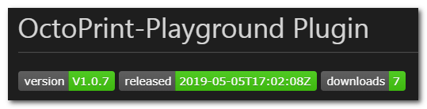

# Add plugin download counter to your README.md
Example could be found here: https://github.com/OllisGit/OctoPrint-CICD_Playground



----------
# Short Description
1. Insert badgeds to your README.md
```
[]()
[]()

```
***Just replace the Gitlab-URL and your are fine!***

2. Activate WebHook in your GitHub-Repository
```  
Settings / Webhooks 
    https://notify.travis-ci.org
```

3. Activate your Repository in Travis
```  
    https://travis-ci.org/
Settings / <select your repository>
```

4. Add ```.travis.yml``` in your root repository
see [.travis.yml](#travisyml)

5. Change your update url in the ```__init__.py``` file
```
__init__.py
--------
##~~ Softwareupdate hook
def get_update_information(self):
...
pip="https://github.com/OllisGit/OctoPrint-CICD_Playground/releases/latest/download/master.zip"
```
***Just replace the Gitlab-URL and your are fine!***

----------
# Detailed Description

The solution is based on the following steps

1. Create badge-image: done via [http://shields.io](http://shields.io/)
2. Provide endpoint for download statistics: done via github rest api
3. Create downloadable plugin artifact (a.k.a release asset): manually or via https://travis-ci.org/
4. Change the pip-download url in your plugin

1 ) Shield.io provides pre-defined badges, static or dynamic image creation.
I use the following urls: 

Two dynamic images for latest version-name and release-date:
```
https://img.shields.io/badge/dynamic/json.svg?color=brightgreen&label=version&url=https://api.github.com/repos/OllisGit/OctoPrint-CICD_Playground/releases&query=$[0].name

https://img.shields.io/badge/dynamic/json.svg?color=brightgreen&label=released&url=https://api.github.com/repos/OllisGit/OctoPrint-CICD_Playground/releases&query=$[0].published_at
```
In Detail you need the following information: github api-endpoint and a json path query to select the correct information. E.g.:
```
url: https://api.github.com/repos/OllisGit/OctoPrint-CICD_Playground/releases
query: $[0].published_at
```

Pre-defined for total downloads:
```
https://img.shields.io/github/downloads/OllisGit/OctoPrint-CICD_Playground/latest/total.svg
```

More descriptions how to use this could be found here: https://shields.io/#dynamic-badge

**Finaly the Markdown looks like this:**
```
[]()
[]()

```
*Just replace the Gitlab-URL and your are fine!*

2 ) The GitHub API (https://developer.github.com/v3/repos/releases/) provides several information about the releases. You need to filter the response via JSON-Path and put it into the image-url (see above) 

BUT the biggest pain in the ... is, that the response only provides download-counts for assets and not for the source zip file (<repo>/archive/{target_version}.zip is not counted).
So, it is necessary to create an release asset zip-file of the current sourcecode.

3 ) You can do this manually or by travis-ci.org. 
In my case the travis build is triggerd when I push something to the repo. The build creates an zip-file of the current master branch, creates a draft-release and attach the zip file as “master.zip” to the draft-release as an asset.

It was a little bit tricky to update an release, but thank google this problem could be solved. 
If you need more info about the build-job just let me know or look into the example or look below [Setup Travis](#setup-travis)

4 ) Normally the pip update url looks like this: 
`pip="https://github.com/OllisGit/OctoPrint-CICD_Playground/archive/{target_version}.zip`

You need to change it to:
```
__init__.py
--------
##~~ Softwareupdate hook
def get_update_information(self):
...
pip="https://github.com/OllisGit/OctoPrint-CICD_Playground/releases/latest/download/master.zip"
```
Now, if you push (merge) some data (e.g. setup.py with new version-number) travis execute the build and creates a draft-release. Octoprint didn’t recognizes this, because it is a draft-release (default-behavior).

You need to create the release manual, by editing the draft via the github ui. 

After you released the version, Octoprint detects the new version, download/install it and the download badge counter on the plugin homepage is increased (could take 1-3 minutes).

-----
# Setup Travis
Following steps are needed:

- Login to Github and check that you have a "Personal Accesstoken". This token is needed, so that travis could push the zip-file to your github-release. 
  
    Go to "Settings / Developer Settings / Personal access tokens"

    Activate the scope "repo"

- Go to your Github-Project and activate the travis-webhook: "Settings / Webhooks"

    Payload URL: https://notify.travis-ci.org

    Content type: application/x-wwww.form-urlencoded

    Individual events: Just the push event

- Go to [Travis-Page](http://travis-ci.org) / Settings and select your Repository

- Add the "Personal access token" as an "Environment Variable" to your selected repo, like this `GITHUB_TOKEN = 483f7219e9e15d70....` ("Settings / Environment Variables")

- Copy `.travis.yml` to your Octoprint root folder (no changes needed)

## .travis.yml
``` 
##
## Simple script to build a zip file of the whole repository
##

script:
# debug  - echo 'Hello World'
  - zip -r master *
# debug  - ls -al

## see "Fix travis automatic build and deploy"
## https://github.com/oliexdev/openScale/pull/121
## https://github.com/oliexdev/openScale/pull/121/files
before_deploy:
  - git tag -f travis-build  
  - git remote add gh https://${TRAVIS_REPO_SLUG%/*}:${GITHUB_TOKEN}@github.com/${TRAVIS_REPO_SLUG}.git
  - git push -f gh travis-build
  - git remote remove gh

deploy:
  name: "V1.X.X-draft"
  #prerelease: true
  draft: true
  provider: releases
  api_key: "${GITHUB_TOKEN}"
  file: "master.zip"
  overwrite: true
  skip_cleanup: true
  target_commitish: $TRAVIS_COMMIT
```