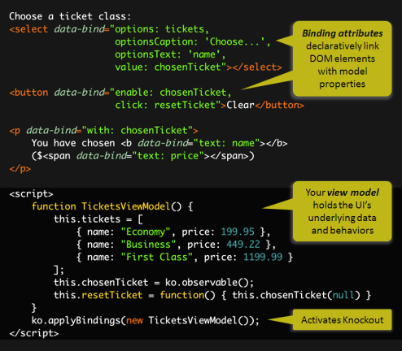

- [h1](#h1)
  - [h3](#h3)

# Octoprint UI-Sections
The UI of Octoprint is seperated in the following areas. Each area could be adapted withj a Jina2-Template.

Just us the following namingconventions (path: ```/templates/'yourpluginId'_'area'.jinja2```)

Areas
* <plugin_identifier>_tab.jinja2			-> Tab
* <plugin_identifier>_navbar.jinja2		    -> Header
* <plugin_identifier>_sidebar.jinja2		-> Left sidebar
* <plugin_identifier>_settings.jinja2		-> Settings

# How does the UI-Communication work

UI use https://knockoutjs.com/ for UI-Widget to JavaScript-Model Binding (2way binding)




In Octoprint it is used as followed:

## Knockout in Octoprint
1. create 


# Hijack Print-Button

## h3

